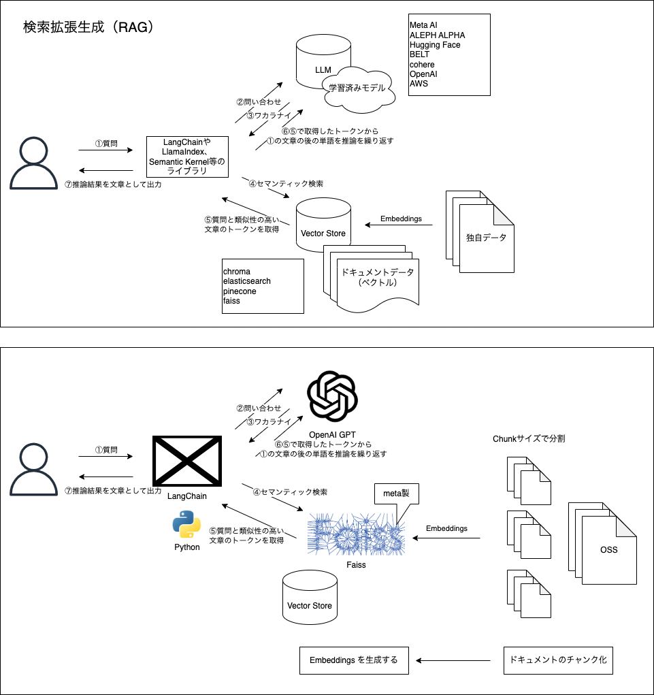

# ChatGPT とベクトルデータストア(Elasticsearch)による未学習ソースコードの爆速理解(いわゆる RAG 構成)

## ゴール

未学習のソースコードをローカルに構築した Elasticsearch に [Embeddings](https://platform.openai.com/docs/guides/embeddings/what-are-embeddings) し [LangChain](https://python.langchain.com/docs/get_started/introduction) を使って質問/回答を得る。

## ユースケース

受け継いだシステムで引き継ぎがなくソースコードだけがある状態のとき、システムを迅速に理解、把握するため手段として。

## アーキテクチャ

## ChatGPT API 節約テクニック

ChatGPT API はトークン数に応じて課金される仕組み。そのためトークン数をどれだけ抑えることができるかがポイントになる。

API 料金の計算方法

- 使用モデルにおける利用単価 \* (入力トークン数 + 出力トークン数)

出力トークン数の注意事項

- 出力トークン数は、最終的に採用した出力ではなく、モデルが「計算結果として出力したトークン数」になる場合がある。そのため、「生成結果数（n）」や「最良出力選定時の候補数（best_of）」が 1 より大きい場合は、出力トークン数が増加する。

節約テクニック

- 英語で質問する
  - 日本語の例：「こんにちは」は 5 トークン
  - 英語の例：「Hello」は 1 トークン
- できるだけ簡潔に質問しいかに期待通りの結果を短く出力できるかが勝負
- 使いすぎても大丈夫なように利用上限を設定する

「 [Tokenizer](https://platform.openai.com/tokenizer) 」という OpenAI のウェブサイト上で公開されているツールでトークン数を確認できる。

## 補足：トークンとは

以下の記事が非常に分かりやすい。

- https://book.st-hakky.com/data-science/llm-token-article/

**単語トークン化（Word Tokenization）**:
テキストを単語ごとに分割する方法です。一般的な単語トークン化手法には、スペースや句読点に基づく方法や、辞書を使用して単語を特定する方法などがあります。

具体的には以下のようになります。

- 入力テキスト： "I love eating pizza."
- トークン化後の結果： ["I", "love", "eating", "pizza", "."]

**文字トークン化（Character Tokenization）**:
テキストを個々の文字に分割する方法です。この手法では、単語の境界を気にせず、文字の並びをトークンとして扱います。

具体的には以下のようになります。

- 入力テキスト: "Hello"
- トークン化後の結果: ["H", "e", "l", "l", "o"]

**サブワードトークン化（Subword Tokenization）**:
テキストをより小さな部分文字列（サブワード）に分割する方法です。

これは、単語レベルと文字レベルの中間に位置する手法で、言語の形態素解析や効率的な表現を考慮しています。代表的なサブワードトークン化手法には、Byte-Pair Encoding（BPE）や SentencePiece などがあります。後程説明しますが、ChatGPT はこの方法でトークン化したものを使っています。

具体的には以下のようになります。

- 入力テキスト: "ChatGPT は素晴らしいです！"
- トークン化後の結果: ["Chat", "##G", "##PT", "は", "素晴", "##ら", "##しい", "です", "！"]
